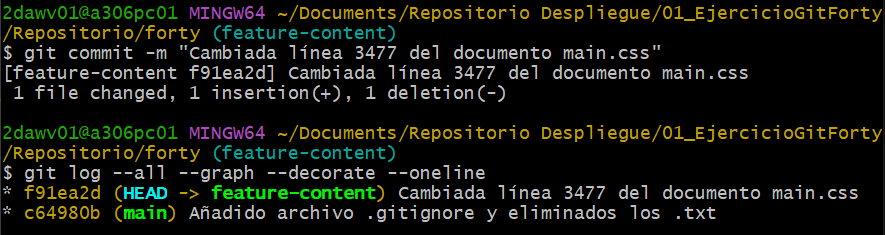
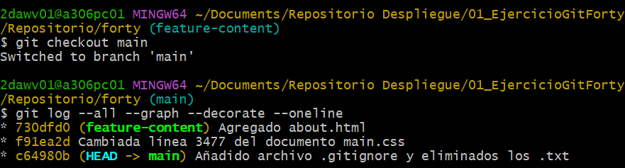
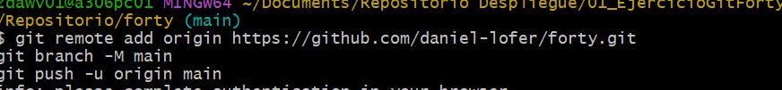
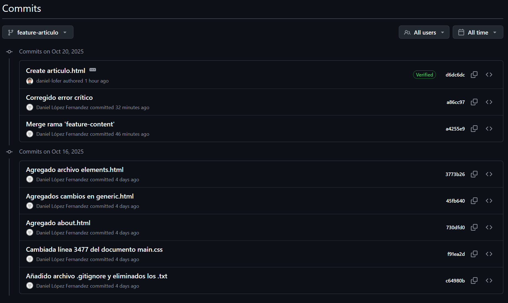

# 01 - Ejercicio de Git - Forty - local y remoto

> Módulo: Despliegue de Aplicaciones Web
>
> Profesora: Inés Menéndez
>
> Alumno: Daniel López Fernández

[TOC]

## Trabajo en local

1. Inicializa un nuevo repositorio Git en una carpeta llamada `"forty"` y agrega los archivos proporcionados en el aula virtual.

   

2. Renombra la rama master a main.

   Como se puede observar en la imagen anterior, la rama main ya viene dada con ese nombre.

   Para cambiar el nombre en caso de que se llamase master, habría que escribir el siguiente código:

   ```bash
   $ git branch -m main
   ```

3. Haz que los ficheros README.txt, LICENSE.txt y passwords.txt sean ignorados por el control de versiones.

   Para comenzar, habría que agregar en el archivo **.gitignore** el nombre de aquellos documentos que se desea eliminar.

   

   A continuación, procederíamos a eliminar los archivos previamente configurados. Esto lo logramos con el comando siguiente:

   ```bash
   $ git rm --cached [nombreArchivo]
   ```

   Tras esto, agregamos el archivo .gitignore al repositorio

   ```bash
   $ git add .gitignore
   ```

   ```bash
   $ git commit -m [comentario]
   ```

   Hacemos un git status para poder saber que el .gitignore funciona y se ignoran los dos documentos.

   

4. Crea el archivo `passwords.txt`. Comprueba que el control de versiones lo ignora.

   Creamos mediante el comando el documento y acto seguido comprobamos que no desea subirlo al repositorio.

   

   

5. Crea una rama llamada `"feature-content"`. Muévete a esa rama. Cambia, en la línea 3477, el `font-size` por `1.5em` en el archivo `main.css`. Ver los logs de la forma más gráfica posible.

   

   

6. Elimina el archivo `"passwords.txt"` en la carpeta `forty`. Verifica el estado del repositorio. ¿Hay cambios pendientes?

   No, ya que al ignorar el archivo Git, no se le hace seguimiento en ningún momento.

   

7. Crea un nuevo archivo llamado "`about.html`", partiendo del archivo `generic.html` y agrégalo al repositorio.

   Se crea el archivo desde el explorador de Windows:

   

   A continuación, se agrega y se realiza el commit:

   

8. Cambia a la rama `main`. Examina los logs del repositorio de forma gráfica:

   

9. Modifica algo en el archivo `generic.html`, comprueba que hay cambios, y realiza otro commit. Examina los logs del repositorio de forma gráfica.

   

10. Modifica algo en el archivo `elements.html`. Confirma los cambios, pero no hagas commit.

11. Mira las diferencias de `elements.html`. Los cambios no nos gustan, deshaz los cambios y comprueba que no hay cambios pendientes.

    

12. Muestra las diferencias entre ambas ramas.

    

13. Fusiona la rama `"feature-content"` con la rama principal (main). Muestra los logs del repositorio de una forma gráfica completa.

    

14. Crea una nueva rama llamada "`hotfix`" y en ella, corrige un error crítico en el archivo "`index.html`". 

    

15. Fusiona la rama "`hotfix`" con la rama principal y verifica el historial de commits de forma que se vean todas las ramas gráficamente. ¿Borrarías la rama `hotfix`? ¿En qué caso? ¿Cómo?

    

    La rama `hotfix` no la eliminaría ya que es usualmente utilizada para corregir errores y, por tanto, es bastante útil. Para eliminarla si se desease, se debería utilizar el comando siguiente, de manera local:

    ```bash
    $ git branch -D hotfix
    ```

    De manera remota:

    ```bash
    $ git push origin --delete hotfix
    ```

16. Muestra el historial de cambios limitado a los tres últimos commits.

    

17. Etiqueta el commit actual como "v1.0" y muestra las etiquetas existentes.

    

## Trabajo en remoto

1. Sube al remoto los ficheros de tu repositorio local:

   

2. En local, crea una rama 'feature-head'. Cambia el título en la sección los comentarios del head de index.html, borra head , o previos, también. Confirma y sube los cambios al remoto.

   

3. En remoto, crea una rama 'feature-articulo'. Duplica la página generic , nómbrala como  articulo.html, y añade como contenido un artículo sobre Git. Confirma los cambios y realiza un commit. Muestra los commits del repositorio tal como se ven en GitHub.

   

4. En el repositorio local  examina los cambios. Actualiza el repositorio con el remoto. Fusiona en 'main' las dos ramas 'feature'. Crea la etiqueta 'v2.0'. Muestra los logs, commits, etiquetas y ramas actuales, en local y en remoto.

   

   

   Muestra del log en Git:

   

   Muestra del log en GitHub:

   

   

5. En tu copia local, crea una rama `nueva`. En la rama nueva, cambia los enlaces de la página `index.html` para que apunten correctamente a la nueva página `articulo.html`. Confirma los cambios.

   

6. Muestra los logs de forma que se vean las ramas en tu copia local.

   

7. Te gusta el resultado de los cambios. Incorpora los cambios de la rama "nueva" a la principal.

   

8. Sube los cambios al remoto borrando la rama nueva, si es necesario. Comprueba primero con un comando en local, las ramas que hay en el repositorio nuevo.

   

9. Muestra en local los cambios en el archivo index.html entre la versión actual y la anterior.

   

10. En el repositorio en GitHub, navega hasta el archivo `index.html` y selecciona la opción "history".


